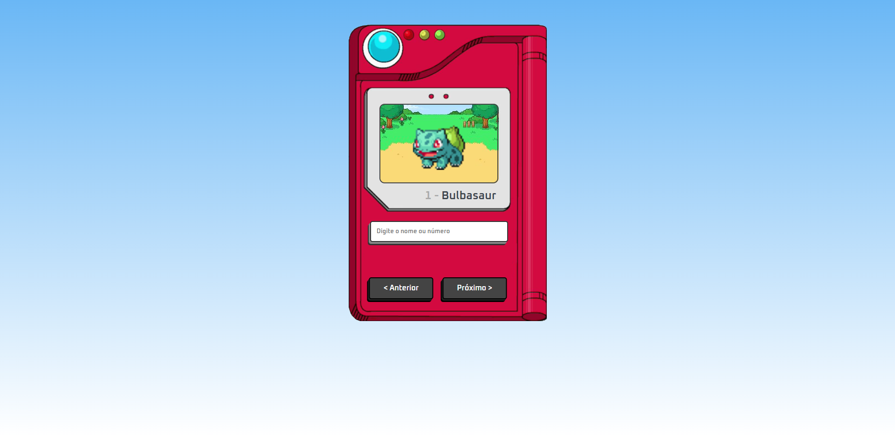

<h1 align="center"> Pokédex </h1>

Pokedex criada utilizando HTML, CSS e JavaScript, com base nos ensinamentos do [vídeo - Como criar uma Pokedex com HTML, CSS e JavaScript | Projeto Completo](https://youtu.be/SjtdH3dWLa8) do canal [@ManualdoDev](https://www.youtube.com/@ManualdoDev) no Youtube. 

  <a href="#-tecnologias">Tecnologias</a>&nbsp;&nbsp;&nbsp;|&nbsp;&nbsp;&nbsp;
  <a href="#-projeto">Projeto</a>&nbsp;&nbsp;&nbsp;|&nbsp;&nbsp;&nbsp;
  <a href="#-layout">Layout</a>&nbsp;&nbsp;&nbsp;|&nbsp;&nbsp;&nbsp;
  <a href="#memo-licença">Licença</a>

 

  

## 🚀 Tecnologias

Esse projeto foi desenvolvido com as seguintes tecnologias:

- HTML 
- CSS
- JavaScript

## 💻 Projeto

A Pokédex é uma enciclopédia virtual que detém todas as espécies de Pokémon. Pokémon é uma franquia de mídia que pertence a The Pokémon Company,tendo sido criada por Satoshi Tajiri em 1995. Ela é centrada em criaturas ficcionais chamadas "Pokémon", que os seres humanos capturam e os treinam para lutarem entre si com seus ataques de diversos tipos.

## 🔖 Layout

Você pode navegar pelo projeto através [DESSE LINK](https://thiagomonts.github.io/pokedex/).

## :memo: Licença

Esse projeto está sob a licença MIT.

---

Desenvolvido por [Thiago Honorato](https://www.linkedin.com/in/honoratothiago/)
